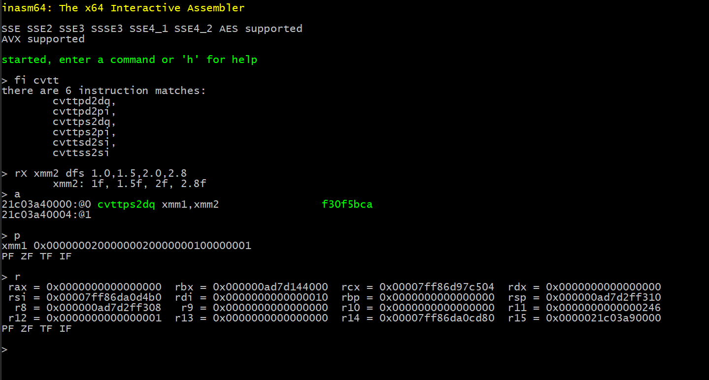

# InteractiveAssembler64

``#inasm64``

This project is Work-In-Progress, but the end goal is pretty clear; a simple command line interactive IA 64 assembler inspired by the old DOS debug.exe. With it you can interatively enter and run IA-64 [_64-bit Long Mode_](https://en.wikipedia.org/wiki/Long_mode) assembly for Intel CPUs.

## Why?
Because I think it's nice to be able to just write some lines of assembly and see them execute immediately. There are a lot of  instructions available on modern CPUs and being able to try them out and see the effect interactively is nice. 
It's also an interesting project because it involves writing a small debugger using the Windows Debug APIs, and interacting with an assembler. 

## When?
It's a pet project, and with a full time job and two kids it's not going to be finished quickly!
If you're interested then please come back occasionally to check up on progress, I'll be using twitter ``@psjarlo`` to post updates now and then too.

# How to Build
- Clone this repo and [Intel XED](https://github.com/intelxed/xed) so that you get this structure:
``` code
- root \
       |- InteractiveAssembler64
       |- xed
```
- Build XED according to instructions (straight forward, but requires Python27) as a library (not *shared*).
- Open up ```inasm64.sln``` and you're good to go. 

# Running Inasm64
This is *WIP*, many of the commands are not finished yet, but the most basic use is;

- ```a``` to start assembling.
- empty line to finish assembling.
- ```p``` to start single stepping from the first assembled instruction.
- ```r``` to dump registers.
- ```q``` to quit.

# Code
## Structure
The project is broken down into three main components living under the root namespace, ``inasm64``
- The runtime
- The assembler
- The CLI (Command Line Interface)

## Runtime ``inasm64::runtime``
The runtime takes binary IA-64 instructions as input and lets you execute them, one by one. 
At the core of the runtime is a debugger (using the Windows DebugAPI) which single-steps the code to run. It also provides access to the execution context (registers, flags).

## Assembler ``inasm64::assembler``
The assembler consists of a front end and a back end where the front end (in ``assembler.cpp``) is responsible for parsing single line ([NASM syntax](https://en.wikibooks.org/wiki/X86_Assembly/NASM_Syntax)) assembly statements and converting these to a generic tokenised format (a ``Statement``).
The ``Statement`` structure encodes information like the operands, instruction, width prefixes (like ``dword``), and the operand types (register, immediate, or memory).
This format is then used by the back end "assembler driver" to generate instruction bytes, using Intel XED as the back end. 
Note that there is no optimisation step in the assembler, what you type in is what you get. This is important to keep in mind if you are comparing the generated instruction bytes with the output of a different assembler, for example NASM, which often make small changes to optimise for size. 
For example, using NASM 2.13, the statement

```code asm
mov rax, 42
```

generates the instruction bytes ```B82A000000``` which is equivalent to ```mov eax,42```. As the high dword of ```rax``` is cleared in this operation the result is the same, but with fewer instruction bytes than the "correct" sequence 
```48B82A0000000000```, which is what Inasm64 generates. 

## CLI ``inasm64::cli``
The CLI provides a simple command line interface for driving the runtime and assembler. It takes commands modelled on the old ``debug.exe`` and the modern ``Windbg``. In architectural terms the CLI provides a sort of "presentation layer", binding and controlling the runtime and assembler.

# Tools used
- [Microsoft Visual Studio 2019 Community Edition](https://visualstudio.microsoft.com/vs/) for all the dev.
- [NASM 2.13 and Ndisasm](https://www.nasm.us/) for correctness checking, comparing generated instruction bytes.
- [HxD](https://mh-nexus.de/en/hxd/) for correctness checking. Being able to *write* hex bytes as well as viewing them is extremely useful in combination with Ndisasm.
- [Intel XED encoder](https://github.com/intelxed/xed) The Encoder for x86-x64 assembly. Takes an *il-like* instruction input format.


